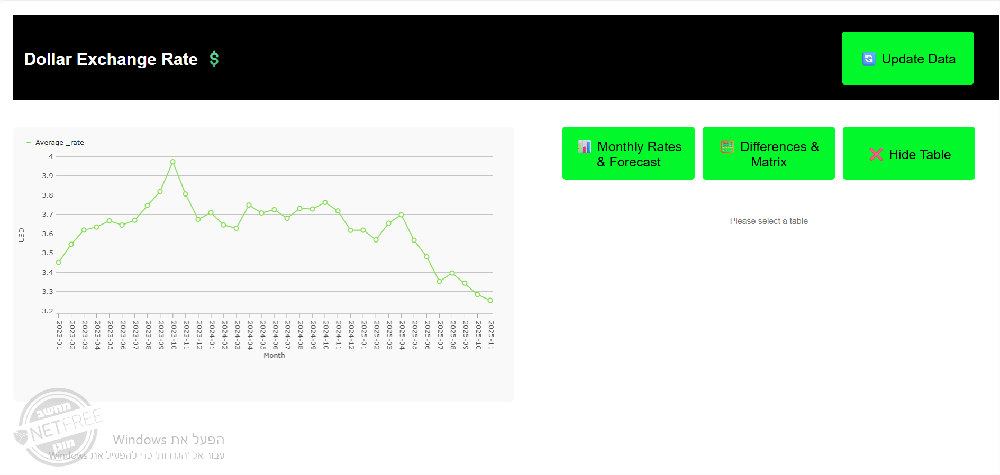

# 💲Dollar Exchange Rate

A computerized information system that displays
the real dollar exchange rate data
According to a monthly average starting in January 2023
And since then, on the first of every month,
the system is automatically updated
And the data is displayed in a graph and tables
Average table and forecast for the next month
And a table of differences between the forecast and the average
As well as the multiplication of matrices to show deviation



## Structure

```text
.
├── client
│   ├── src
│   │   ├── api
│   │   │   └── fetchExchangeRates.test.ts
│   │   │   └── fetchExchangeRates.ts
│   │   ├── components
│   │   │   ├── Dashboard
│   │   │   │   ├── Dashboard.tsx
│   │   │   │   └── Dashboard.css
│   │   │   ├── Graph
│   │   │   │   ├── Graph.tsx
│   │   │   │   └── Graph.css
│   │   │   ├── Table
│   │   │   │   ├── DifferencesTable.tsx
│   │   │   │   ├── MonthlyRatesTable.tsx
│   │   │   │   └── Table.css
│   │   │── Hooks
│   │   │      ├── useExchangeRates.ts
│   │   │      └── useExchangeRates.
│   │   ├── types
│   │   │   └── exchangeRate.ts
│   │   ├── utils
│   │   │   └── calculations
│   │   │        ├── avarages.test.ts
│   │   │        ├── avarages.ts
│   │   │        ├── differences.test.ts
│   │   │        ├── differences.ts
│   │   │        ├── forecast.test.ts
│   │   │        ├── forecast.ts
│   │   │        ├── multiplication.test.ts
│   │   │        ├── multiplication.ts
│   │   │   └── ui
│   │   │        ├── getRateColor.test.ts
│   │   │        ├── getRateColor.ts
│   │   │   ├── buildDifferencesTable.test.ts
│   │   │   └── buildDifferencesTable.ts
│   │   ├── App.tsx
│   │   └── main.tsx
│   ├── .env
│   ├── .env.sample
│   ├── .eslintrc.js
│   ├── Dockerfile
│   ├── eslint.config.mjs
│   ├── index.html
│   ├── jest.config.js
│   ├── package.json
│   ├── tsconfig.json
│   └── vite.config.ts
│
├── server
│   ├── src
│   │   ├── api
│   │   │   └── currencyApi.ts
│   │   ├── app
│   │   │   └── app.ts
│   │   ├── controllers
│   │   │   └── exchangeRate.controller.ts
│   │   ├── db
│   │   │   ├── index.ts
│   │   │   ├── schema.sql
│   │   │   └── seeds.ts
│   │   ├── routes
│   │   │   └── exchangeRate.route.ts
│   │   ├── services
│   │   │   ├── exchangeRate.service.ts
│   │   │   └── monthlyJob.ts
│   │   └── main.ts
│   ├── tests
│   │   ├── api
│   │   │   └── currencyApi.test.ts
│   │   ├── app
│   │   │   └── app.test.ts
│   │   ├── controllers
│   │   │   └── exchangeRate.controller.test.ts
│   │   ├── db
│   │   │   └── seed.test.ts
│   │   ├── services
│   │   │   ├── exchangeRate.service.test.ts
│   │   │   └── monthlyJob.test.ts
│   ├── .env
│   ├── .env.sample
│   ├── .eslintrc.js
│   ├── Dockerfile
│   ├── eslint.config.mjs
│   ├── jest.config.js
│   ├── package.json
│   └── tsconfig.json
├── .env
├── .env.sample
├── .gitignore
├── docker-compose.yml
└── README.md

```

## Development

- TS.
- by docker(dockerfile).
- TDD.
- React-vite

**How to run the system?**

run the command

```bash
 docker compose up --build
 ```

now you can open the system at <http://localhost:5173/>
